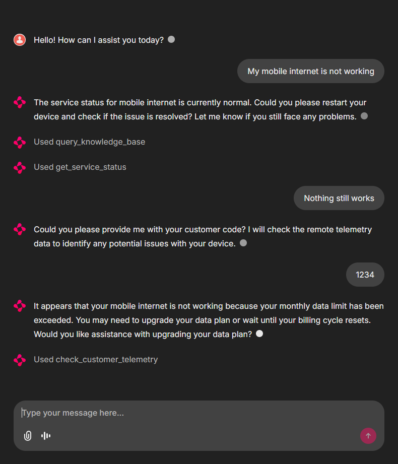
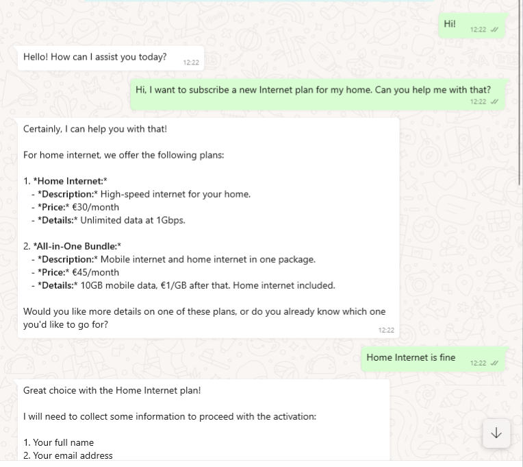

# Agentic Call Center sample

|  |  |
| --- | --- |

## Overview

This sample application demonstrates how to use of Vanilla AI Agents framework to build a basic call center in the context of a generic TelCo company. It features a phone call and WhatsApp integration (via Azure Communication Services) to offer a more realistic, multi-channel experience.

The application leverages [**Vanilla AI Agents**](https://github.com/Azure-Samples/vanilla-aiagents) framework at its core to implement and orchestrate the agents' behavior. The agents are implemented as a separate microservice that can be scaled independently from the rest of the application.

## Architecture

### Diagram

```mermaid
graph TD
    subgraph Frontend
        A[Web Interface - Chainlit]
        B[WhatsApp]
        K[Phone]
        F[Azure Event Grid]
        G[Azure Communication Services]
        J[Azure Function]
    end

    subgraph Backend
        C[API Layer]
        H[Azure Container Apps]
        E[Azure Cosmos DB]
    end

    subgraph Agents
        D[Agents]
        H[Azure Container Apps]
        E[Azure Cosmos DB]
        I[Azure AI Search]
    end

    A -->|HTTP| C
    C -->|HTTP| D
    C -->|Persist| E
    B -->|Event| G
    K -->|Event| G
    G -->|Trigger| F
    C -->|Hosted on| H
    D -->|Hosted on| H
    D -->|Query| E
    D -->|Query| I
    F -->|Event| J
    J -->|HTTP| C
```

### Codebase

The codebase is structured as follows:

- `api/` contains the main business logic exposed as a REST API with FastAPI.
- `telco-team/` contains the agent team that simulate the call center agents.
- `ui/` contains a simple web interface to interact with the call center agents using Chainlit.
- `functions/` contains the Azure Functions that handle the WhatsApp integration.
- `voice/` contains code handling phone call integration.
- `infra/` contains the Azure Bicep templates to deploy the application.

### Azure Services

The following Azure services are used in this sample application:

- `Azure Container Apps (ACA)` to host the FastAPI REST API and the Chainlit web interface.
- `Azure Container Registry (ACR)` to store the Docker images.
- `Azure Cosmos DB` to store the chat messages.
- `Azure AI Search` to enable RAG.
- `Azure OpenAI` to support the GenAI agents.
- `Azure Communication Services` and `Azure Service Bus+EventGrid` to interface via WhatsApp and handle phone calls.

## Deployment

Most straitforward way to deploy this application is to use **Azure Developer CLI**:

1. Ensure you have `azd` installed. If not, follow [official instructions](https://learn.microsoft.com/en-us/azure/developer/azure-developer-cli/install-azd) to set it up.
1. Run `azd auth login` to authenticate with Azure CLI.
> [!TIP]
> Remember you can pass `--tenant-id` parameter to select a specific tenant to authenticate with. Additional parameters for non-user scenarios are also available, please check [official docs](https://learn.microsoft.com/en-us/azure/developer/azure-developer-cli/reference#options-3).
1. Run `azd up` to deploy the application.
> [!NOTE]
> The deployment process will take some time to complete. You can monitor the progress in the terminal. Once the deployment is finished, all environment variables will be available in `.azure/<env name>/.env` file.

### WhatsApp integration

> [!WARNING]
> At this time there is no automated way to deploy the WhatsApp integration. You will need to follow the instructions in the [Azure Communication Services documentation](https://learn.microsoft.com/en-us/azure/communication-services/quickstarts/advanced-messaging/whatsapp/connect-whatsapp-business-account) to configure a phone number, associated it with WhatsApp Business profile and create a WhatsApp channel.
>
> Then update the `ACS_CHANNEL_REGISTRATION_ID` environment variable in the Azure Container Apps settings to match it.

## Local development

To run the application locally, follow these steps:

1. Fill in a `.env` file by running
    ```bash
    azd env get-values > .env
    ```
1. Open different terminals for each of the following steps:
    1. Run the agents host with `invoke start-host`
    1. Run the FastAPI API with `invoke start-api`
    1. Run the Chainlit UI with `invoke start-chat`

> [!NOTE]
> Running **Voice calling** integration locally is not covered in this guide.

> [!NOTE]
> Running **WhatsApp** integration locally can be done by running the Azure Function locally, but you'll need to stop the Azure Function in the cloud to avoid conflicts.